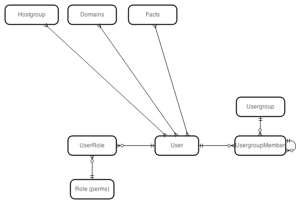
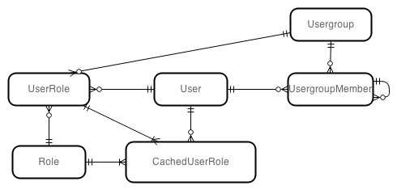
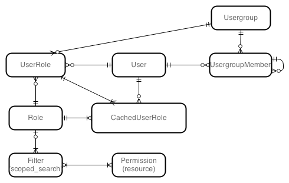

# Current model

Two independent layers 

* roles
* filters

Role are used for authorization of controller actions. We load all roles for current user and check whether he has permission to execute action. Permissions are hardcoded, you can assign permissions to roles.

Filters are defined per user. It's hardcoded what they can filter. It does not say anything about context in which they are applied, e.g. user filtered to hostgroup HG1 could mean he can edit HG1 or he can build hosts in HG1.



# What do we want

We want to assign roles and filters also to user groups. User can be member of multiple groups. Groups are organized in graph. It's inefficient to go through graph every time we need to check permissions.

We want to have different permissions for different subsets eg:

* user can edit hosts in hostgroup HG1
* user can view all hosts

# Changes

## User roles improvement

We can assign roles to usergroups. Also it should be possible to define admin flag on usergroup. We'll also take similar approach to cache user membership.



## Filters improvement

* We extract Permissions from Role and map them to filtered resources (Host, Hostgroup, ...)
* We extract Filter from User to a new entity.
* We allow to specify filters by scoped_search syntax.
* We assign filters to Role



There will be two types of filters

* generic that select all resources (search string will be NULL)
* filtering (search string actually filters the resulting collection)

When we want to a collection of objects on which user has particular permission we do the searching in following way. We find join User x Filter x Permission, there can occure three situations:

1. if there's any generic filter among result we take Resource.all
2. if there's none generic but still some filters were found we take all of them and join their search strings by OR, and apply it on like this ```"Resource.search_for( (F1) OR (F2) OR (F3) )"``` 
3. if there's none generic nor other user simple does not have permission for this Resource, result is []

When we want to verify permissions for a specific object, we do the same as above and then just check whether object is in resulting collection.

This should be generic enough to apply on any Resource.

## Effective link verification on page

Suppose we have a list of hosts. On every row we can have links to edit, build and destroy host. With this new system we can have different permissions for each host. Since we check every permission separately we'll have to do similar query for every action on page (edit, build and destroy in this case), in other words, it should be linear to actions on page. We already have a collection of hosts displayed on page so queries will be limited by pagination and therefore should not be too complicated to compute.

# Problems

## Taxonomies

We have Organizations and Locations that are currently stay outside of permission system. With new system it should still work if we make Filters scoped by taxonomy. In other words Filter will ```include Taxonomix``` which will limit filter per taxonomy.

## Creating records

Using scoped_search limits us to existing records. It's open question how to verify whether user is authorized to create a new host with some parameters (e.g. 1GB RAM). Filter could forbid that host to be displayed to user but he'd be able to create it.

Two possible ways are

* after_create hack, that would rollback transaction if the record was not found for particular user
* construct validations based on filters (can be tricky)

## Existing data

There would have to be some complex migration that would assign users to newly created Role. Not much time invested to investigated this yet.

